# Introduction

This document describes the architecture and design of a single page web application that interacts with microservices via RESTful APIs.
The key elements in this document include the architecture, user interface, client components, and server classes.

This is a living document that is updated as changes are made each sprint.
The initial document describes the Base code students are given as a starting point for the semester.
Students are expected to update this document as changes are made each sprint to reflect the evolution of their application and key decisions they make.
The Base section serves as an example.

# Base

The Base is a simple application to provide the architecture to the students at the beginning of the semester.
The JavaScript code will be useful examples for students to learn from and leverage in the code they write for sprint 1.
The progressive display of information using collapsible sections and popups will serve as examples of good user interface design.
The overall design is somewhat minimalist/simple for the intended mobile device audience.

### Architecture

The Base architecture is a JavaScript single page web application in an HTML5 browser that uses RESTful APIs to access Micro-services provided by a Java server running on Linux.
The client consists of a minimal index.html file that loads and executes the bundled JavaScript application.
The client and server files are bundled into a single JAR file for execution on the Linux server at a specified port.
The browser fetches the client files from the server on the specified port.

The browser loads the index.html file (by default) which in turn loads the bundled JavaScript single page application bundle.js.
* The single page application makes RESTful API requests to the server on the same port using  JavaScript's asynchronous fetch.  
* A protocol document describes the JSON format for the RESTful API requests and responses.
* JSON Schemas are used to verify requests on the server side and responses on the client side.
* On the client, ReactJS renders the application using ReactStrap, Leaflet, and application defined components.
* GSON is used on the server to convert JSON requests to Java objects and Java objects to JSON responses.
* The client (ulog) and server (SLF4J) logging mechanisms control debugging output during development and production - print statements and console logging should never be used. 

The following architecture elements are not included in the Base system.
They will be added later in the semester.
* Client filesystem.
* Server SQL.
* Server concurrency.

### User Interface

The basic screen in black shows the view on a mobile device, with a header, footer, and trip.
The header contains a earth logo and the team name obtained from the server when the client was loaded.
The footer contains a connection icon along with the current server name and server URL the client is connected to.
The trip shows a map and the current list of destinations.

Rather than buttons or icons to signify actions, we are associating actions with elements that are already on the screen to reduce the clutter.
We are using both popups and collapsible sections in this design rather than choosing to use one exclusively.
* Collapsible/Hidden sections are used for the map and about sections since they have a significant amount of content and we don't need to see them at the same time.
* A popup is used for the URL change since we want to control the interaction until the operation is completed. It seemed more natural than another collapsible section.

#### Clicking on the team name in the header displays an empty about screen.
Clicking again restores the trip screen.
We will fill this in later.

#### Clicking on the map adds to the trip.
Whenever a user clicks on the map, the client should display a marker with latitude, longitude, and a description at that location.
The description is obtained from reverse geocoding.
The location information is also added to the trip list below the map.
We only maintain a single marker at this point displaying the most recently clicked location.

#### Clicking the hamburgers (&#8942;) displays a menu of options.
At the trip level you can add the home (CSU Oval) location or clear the list.
At the destination level you can remove that destination from the list.

#### Clicking on the URL in the footer should let me change the server.
Whenever a user clicks on the URL a popup should open showing the team name, the URL in an input text box, and a Cancel button.
When the user modifies the URL, the client will attempt to connect to the new server and update the configuration.
When the Test button is clicked, it will attempt to connect to the server.
If not successful, nothing changes and the user may continue to make URL changes or click the Cancel button to return to the original sever (it shouldn't change).
If successful, the new server name should appear and a Save button should replace the Test button.
When the user clicks the Save button, the server connection should change and the popup closes, revealing the new servername and URL in the footer.

### Component Hierarchy
The component hierarchy for the base application depicted below shows the our top level App component with four children components.
* App renders the major components on the screen.
* Header renders an icon and a team name in the top banner.
* Footer renders the current server connection in the bottom footer.
* Atlas renders a map.
* About renders information about the team.

We do not show the many ReactStrap components in this hierarchy, even though they will appear when you are debugging on the client.

### Class Diagram
The class diagram for the base application depicted below shows the basic structure of the web server application.

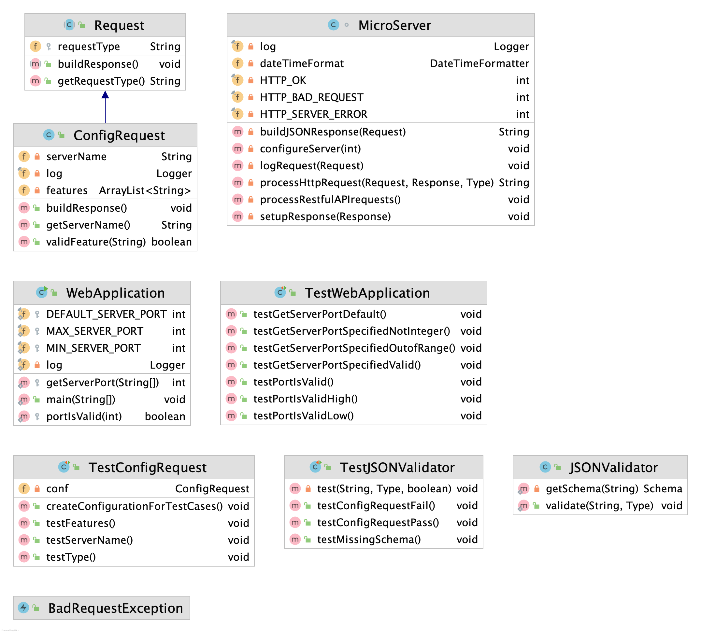

The classes in blue represent the classes specific to this application.  
* WebApplication processes command line parameters and creates MicroServer.
* MicroServer start a web server on the given port, configures the server for security, static files, and APIs for different types of requests, and processes the requests as they arrive.
* JSONValidator verifies a request is properly formatted before attempting to process it using JSON Schemas.
* ConfigRequest is a specific request that allows the server to respond with its configuration to allow interoperability between clients and servers. 
* Request defines the basic components of all requests.
* BadReqeustException allows us to distinguish bad requests from other types of exceptions that may occur.

These test classes provide automated tests for unit testing.
* TestWebApplication
* TestConfigRequest
* TestJSONValidator

# Sprint 1

### User Interface

In this sprint, we will focus on team information.
There are two primary parts:
* browser tab, header, and footer.
* about page which includes team and member information,

Whenever a user clicks the team name in the header, a collapsible section should appear under the header with information about the team.
The collapsible map should disappear so only the about or map are displayed.
A simple toggle in state should be able to control this rendering.
The about page should contain the team name as a heading. 

The team name in the browser tab, header and are simple changes to constants in the client and server.

### Client Components

We will add 3 new components to the base architecture on the client to support the about page.
* Team component will render the team information
* Person component will render the individual information for a team member
* AboutCard component will render the team/individual information in a consistent fashion.

The existing About component will be modified to control the layout of the Team and Person components on the page.

### Server Classes
There are no changes to the server class structure in this sprint.
Only minor changes to text constants are required.

# Sprint 2

### User Interface
In this sprint there are several changes we will be making to the interface:
* A search bar for locations
* A function that highlights a selected location from the trip list and moves the marker to that location on the map
* The home button places a marker at your current geolocation

When a user searches for a location within the search bar they will receive a list of result locations that match the user's search. 
If a user wants to add a location point to their current geolocation they will navigate within the hamburger and click on the home icon.
Whenever a user clicks on a location stored in their trip list that element of the trip list will be highlighted
and the marker will be moved to the selected location without modifying the trip.

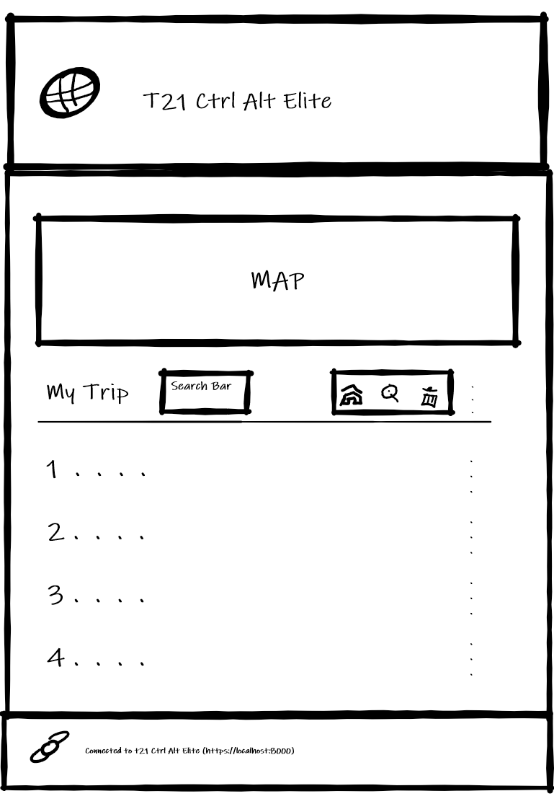

### Client Components

We had ServerSettings passed from Page.js to Planner.js to be utilized in the getCurrentServerUrl.

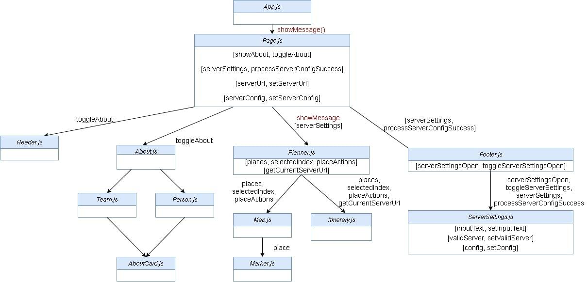

### Class Diagram Changes

Since we added the findRequest functionality there was a small change since the find function extends from request.

# Sprint 3

### User Interface
In this sprint there are going to be many changes to the user interface:
  * We will be adding a save button to the right of the trip title.
  * There will be a load button to the right of the save button.
  * A button will also be embedded in the search bar that generates a random trip.
  * There will be distance between legs added to each location in the itinerary.

When the user wants to save their itinerary they will select the button to the right of the trip title.
If the user wants to load a previously planned itinerary the can click the button to the right of the save icon and select the file they wish to load.
In order to create a randomly generated itinerary the user can press the button on the far right side of the search bar.
If the user wants to see the distance between each location on the trip they can look to the left of each location in the itinerary.

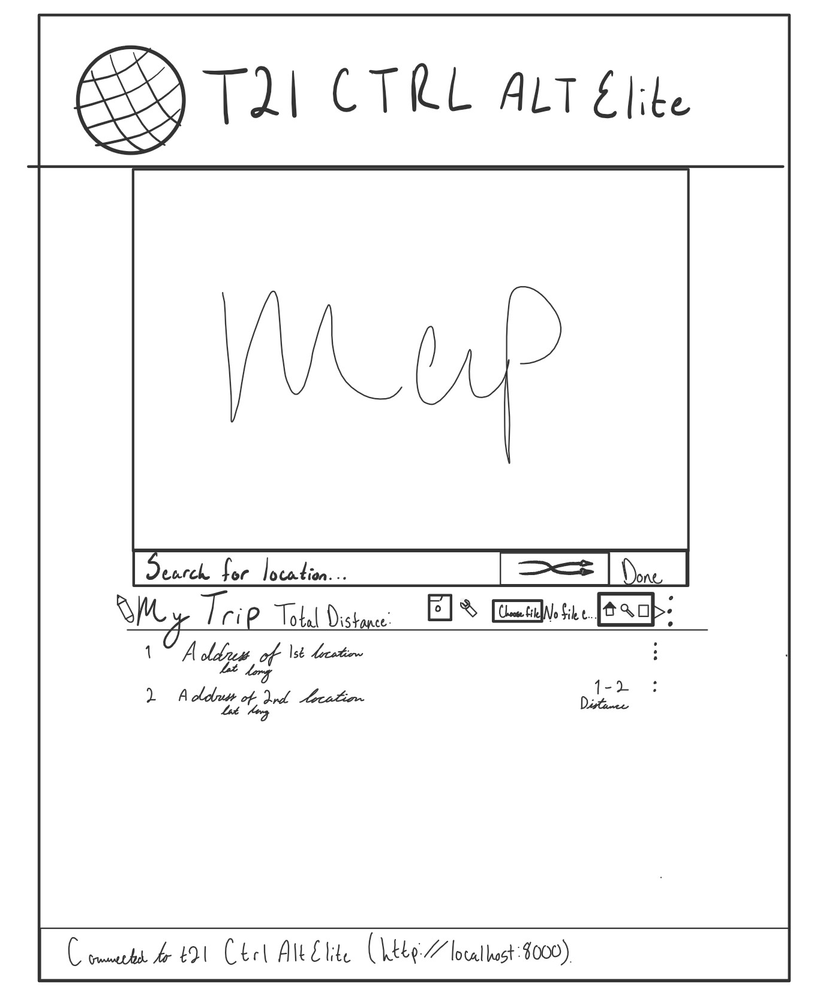

### Client Components

Currently there will be no changes to the client components, but this may change.

### Class Diagram Changes

The only changes that will be made to the class diagram is the addition of the DistancesRequest which extends from Requests

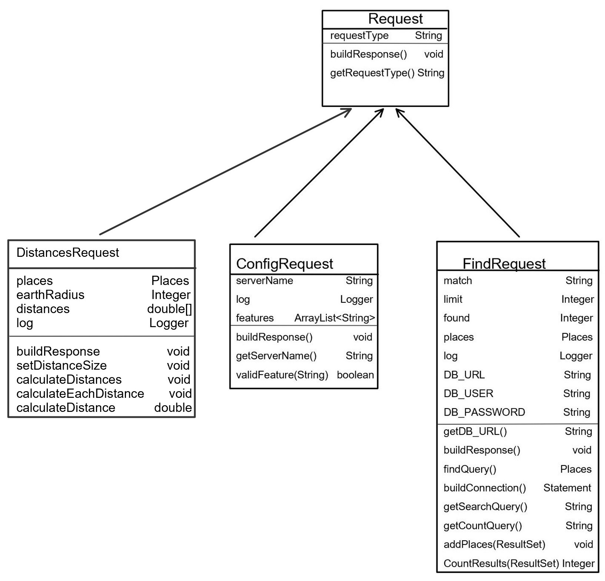

# Sprint 4 

### User Interface

In this sprint there are going to be a couple changes to the user interface:
- One of interface changes is going to be a shorten trip distance
  - This will switch the user to a possibly shortened trip 
  - user will have the ability to go back to their previous trip plan if they don't approve of the shortened trip
- Another interface change is going to be the ability to search by type
  - This will be accomplished with a 'pop up' menu to refine find request searches
- Cosmetic Changes
  - Shorten address names to reduce screen clutter
  - Create popup menu for save and load functions
  - Simplify search bar buttons to icons rather than words
  - Simplify "Total Distance: ", "To Next: " and "To Start: " columns to reduce clutter 
- New Features 
  - Delete user created unit with trashcan button
  - Change start location to any place in trip
  - Trip list items can now be rearranged by dragging place to desired position
  - Trip list now scrollable
  - Trip can now be reversed 
  - Hovering over buttons now gives button description 

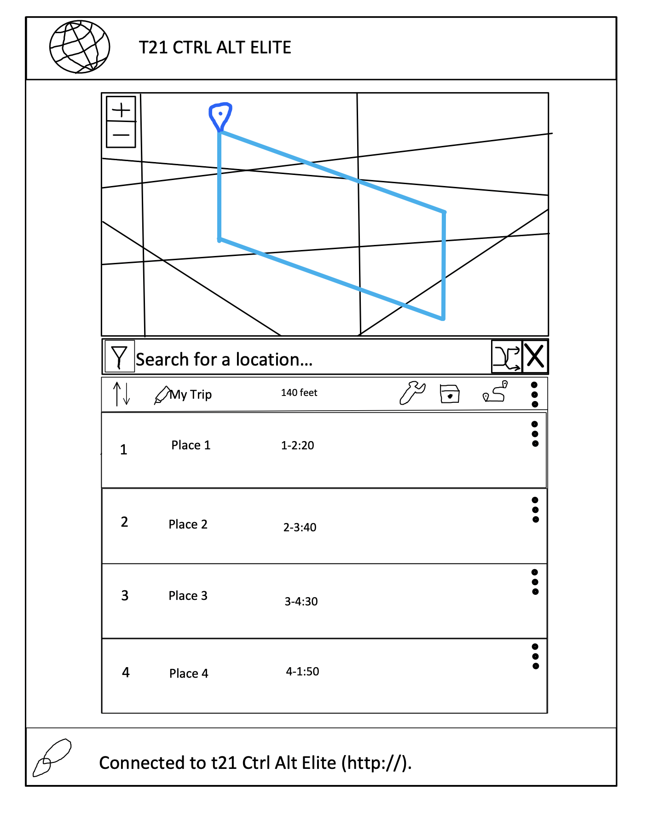

Units UI\
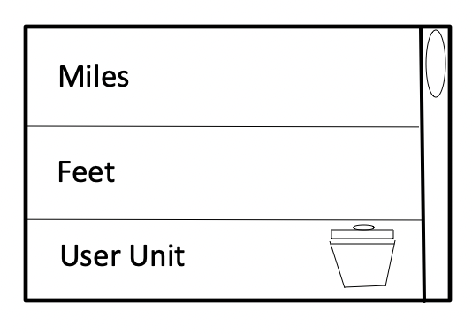

Filter Search UI\
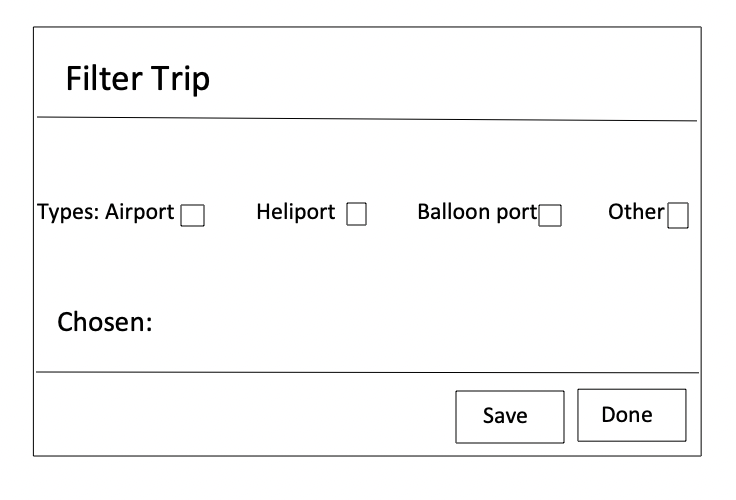

### Client Components

Currently there are no planned changes to the client components but this is subject to change.

### Class Diagram Changes

The only change that will be made to the class diagram is the addition of the TourRequest which extends from Requests.

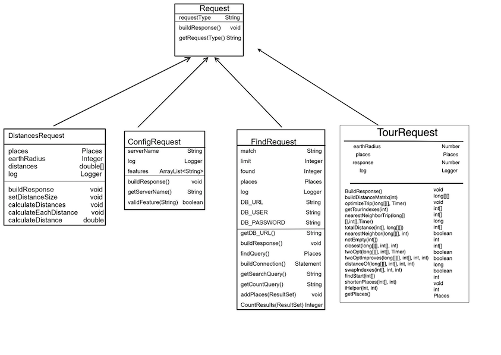

# Sprint 5

### User Interface
We will make a fair amount of changes to the user interface this sprint:
- New map customization modal
  - Opened by a new wrench icon button
  - Rows and dropdowns/other way of choosing new markers/backgrounds/line styles for the map
- Searchbar for filtering preexisting trip by matching a search string
  - Opened by a new button that pops up the modal
- Make list of countries from country search bar much smaller, not fill up the whole screen when many match the search string
- Make find request search bar overlay on itinerary instead of pushing down

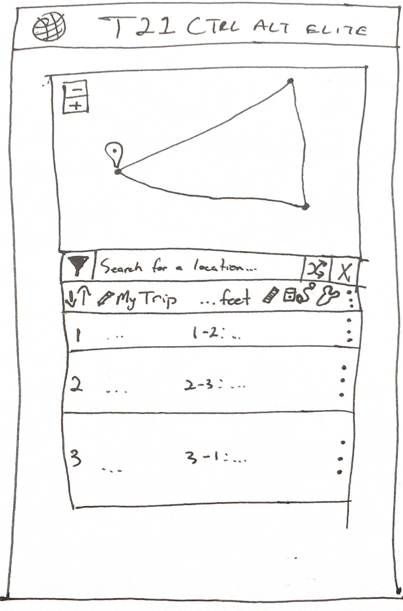

New Map Customization UI\
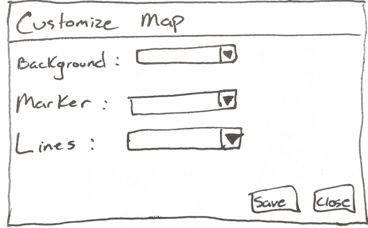

Updated Filter Search UI\
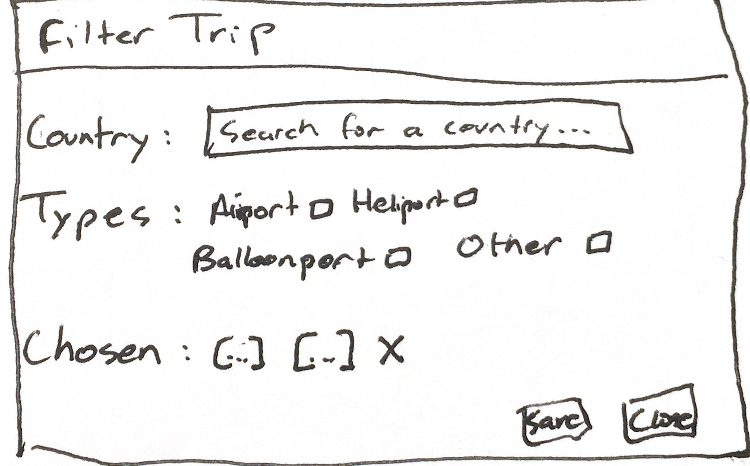

### Client Components

There are no planned changes to the client components.

### Class Diagram Changes

No changes will be made to the class diagram this sprint, no new requests will be created.

